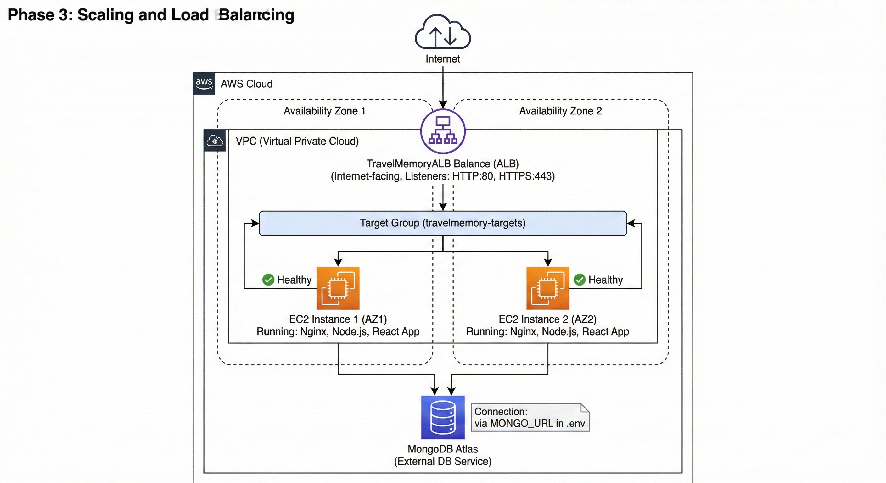
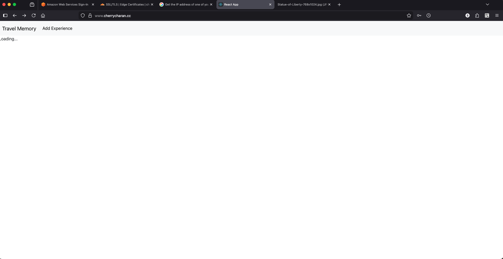
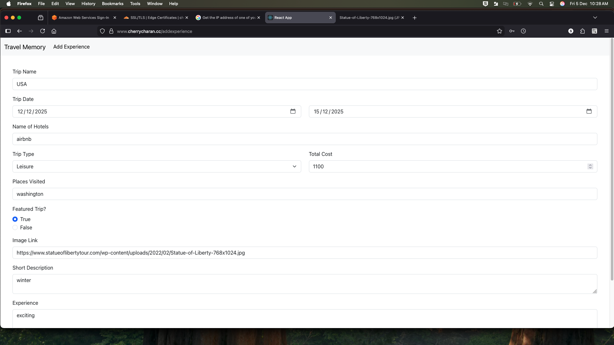

# MERN Stack Application - AWS EC2 Deployment Guide

Comprehensive guide for deploying a MERN (MongoDB, Express, React, Node.js) stack application on AWS EC2 with Nginx reverse proxy and PM2 process management.

---

## Table of Contents

1. [Architecture Overview](#architecture-overview)
2. [Prerequisites](#prerequisites)
3. [Phase 1: EC2 Setup](#phase-1-ec2-setup-and-configuration)
4. [Phase 2: Application Deployment](#phase-2-application-configuration-and-deployment)
5. [Phase 3: Scaling & Load Balancing](#phase-3-scaling-and-load-balancing)
6. [Phase 4: Cloudflare DNS Configuration](#phase-4-cloudflare-dns-configuration)
7. [Troubleshooting](#troubleshooting)
8. [Security Considerations](#security-considerations)

---

## Architecture Overview



```
┌─────────────────────────────────────────────────────┐
│                   Internet Users                    │
└───────────────────┬─────────────────────────────────┘
                    │
        ┌───────────▼──────────────┐
        │  Cloudflare DNS          │
        │  - DDoS Protection       │
        │  - CDN Caching           │
        └───────────┬──────────────┘
                    │
        ┌───────────▼──────────┐
        │  Nginx (Port 80/443) │
        │  - Reverse Proxy     │
        │  - Static Files      │
        └───────────┬──────────┘
                    │
        ┌───────────▴──────────┐
        │                      │
   ┌────▼─────┐         ┌─────▼────┐
   │ /api/*   │         │ /*       │
   │ /trip/*  │         │ Routes   │
   └────┬─────┘         └─────┬────┘
        │                     │
   ┌────▼──────────┐     ┌────▼──────────┐
   │ Node.js       │     │ React Build   │
   │ Backend       │     │ Static Files  │
   │ (Port 3000)   │     │              │
   └────┬──────────┘     └───────────────┘
        │
   ┌────▼──────────────┐
   │ MongoDB Atlas     │
   │ (Cloud Database)  │
   └───────────────────┘
```

---

## Prerequisites

- AWS account with EC2 access
- Basic knowledge of SSH and terminal commands
- A MERN stack application repository
- MongoDB Atlas account (or DocumentDB)
- Domain name registered (required)
- Cloudflare account (free tier available)

---

## Phase 1: EC2 Setup and Configuration

### Step 1: Launch an EC2 Instance

1. **Log in to AWS Management Console**
   - Navigate to EC2 Dashboard
   - Click "Launch instances"

2. **Choose Amazon Machine Image (AMI)**
   - Select: **Ubuntu Server 20.04 LTS (HVM)**
   - Well-maintained and widely supported

3. **Select Instance Type**
   - Choose: **t2.micro** (free tier eligible)
   - Sufficient for development/small production workloads

4. **Configure Instance Details**
   - Keep defaults for initial setup

5. **Add Storage**
   - Default: 8GB (adequate for most applications)

6. **Configure Security Group**
   - Create new security group with the following inbound rules:

   | Port | Protocol | Source |
   |------|----------|--------|
   | 22 | SSH | Your IP or 0.0.0.0/0 |
   | 80 | HTTP | 0.0.0.0/0 (Nginx) |
   | 443 | HTTPS | 0.0.0.0/0 (Nginx) |
   | 3000 | TCP | 0.0.0.0/0 (Backend testing only) |

7. **Review and Launch**
   - Create or select an existing Key Pair (.pem file)
   - **⚠️ Save the .pem file securely** - you cannot recover it later

### Step 2: Connect to EC2 Instance

```bash
# Set proper permissions on key file
chmod 400 your-key-pair.pem

# Connect via SSH (replace with your Public IP)
ssh -i "your-key-pair.pem" ubuntu@<Public-IP-Address>
```

### Step 3: Install Required Software

```bash
# Update package manager
sudo apt update

# Install Node.js and npm
sudo apt install nodejs npm -y

# Install Nginx (reverse proxy & static server)
sudo apt install nginx -y

# Install Git (for cloning repository)
sudo apt install git -y

# Verify installations
node --version
npm --version
nginx -v
```

---

## Phase 2: Application Configuration and Deployment

### Step 1: Backend Configuration

```bash
# Clone your repository
git clone https://github.com/your-username/your-repo.git
cd your-repo

# Navigate to backend directory
cd backend

# Install dependencies
npm install
```

**Create `.env` file in backend directory:**

```bash
sudo nano .env
```

**Add the following configuration:**

```env
PORT=3000
MONGO_URL=mongodb+srv://<username>:<password>@<cluster>.mongodb.net/<db-name>?retryWrites=true&w=majority
```

> **Note:** Replace placeholders with your MongoDB Atlas credentials. For secure .env handling, never commit this file to version control.

**Optional: Test backend locally**

```bash
npm start
# Should see: Server running on port 3000
```

### Step 2: Frontend Configuration

```bash
# Navigate to frontend directory
cd ../frontend

# Install dependencies
npm install
```

**Update API base URL in your frontend configuration file** (typically `src/urls.js` or `src/config.js`):

```javascript
// Development (using EC2 Public IP)
export const BASE_URL = "http://<EC2-Public-IP>/api";

// Production (with custom domain)
export const BASE_URL = "https://yourdomain.com/api";
```

**Build the frontend for production:**

```bash
npm run build
```

> This creates optimized static files in the `build/` directory

### Step 3: Configure Nginx Reverse Proxy

Nginx will:
- Serve static React files
- Route API requests to Node.js backend
- Handle SSL/TLS (optional)

**Create Nginx configuration file:**

```bash
sudo nano /etc/nginx/sites-available/travel-memory
```

**Paste the following configuration:**

```nginx
server {
    listen 80;
    server_name <EC2-Public-IP> yourdomain.com;

    # ===== FRONTEND CONFIGURATION =====
    # Serve React static build files
    root /home/ubuntu/your-repo/frontend/build;
    index index.html index.htm;

    # Client-side routing fallback
    location / {
        try_files $uri $uri/ /index.html;
    }

    # ===== BACKEND REVERSE PROXY CONFIGURATION =====
    # Route all /api requests to Node.js backend
    location /api/ {
        proxy_pass http://localhost:3000;
        proxy_http_version 1.1;
        proxy_set_header Upgrade $http_upgrade;
        proxy_set_header Connection 'upgrade';
        proxy_set_header Host $host;
        proxy_set_header X-Real-IP $remote_addr;
        proxy_set_header X-Forwarded-For $proxy_add_x_forwarded_for;
        proxy_set_header X-Forwarded-Proto $scheme;
        proxy_cache_bypass $http_upgrade;
    }

    # Route specific paths if needed
    location /trip/ {
        proxy_pass http://localhost:3000;
        proxy_http_version 1.1;
        proxy_set_header Host $host;
        proxy_set_header X-Real-IP $remote_addr;
        proxy_set_header X-Forwarded-For $proxy_add_x_forwarded_for;
        proxy_set_header X-Forwarded-Proto $scheme;
    }

    # Gzip compression for better performance
    gzip on;
    gzip_types text/plain text/css text/xml text/javascript 
               application/x-javascript application/xml+rss 
               application/javascript application/json;
}
```

**Enable the configuration:**

```bash
# Create symlink to enable site
sudo ln -s /etc/nginx/sites-available/travel-memory /etc/nginx/sites-enabled/

# Test Nginx configuration for syntax errors
sudo nginx -t

# Restart Nginx
sudo systemctl restart nginx

# Enable Nginx to start on boot
sudo systemctl enable nginx
```

### Step 4: Process Management with PM2

PM2 ensures your Node.js backend:
- Runs continuously
- Auto-restarts on crashes
- Starts on server reboot

**Install PM2 globally:**

```bash
sudo npm install -g pm2
```

**Start your backend with PM2:**

```bash
cd /home/ubuntu/your-repo/backend

# Start the application
pm2 start index.js --name "travel-memory-backend"

# Save PM2 process list
pm2 save

# Set PM2 to start on system boot
pm2 startup

# Follow the output instructions from 'pm2 startup' command
```

**Useful PM2 commands:**

```bash
# Monitor running processes
pm2 status

# View logs
pm2 logs travel-memory-backend

# Restart process
pm2 restart travel-memory-backend

# Stop process
pm2 stop travel-memory-backend

# Delete process
pm2 delete travel-memory-backend
```

---

## Phase 3: Scaling and Load Balancing

For high-availability deployments with multiple EC2 instances:

### Create Second EC2 Instance

1. Repeat **Phase 1: Steps 1-3** to create another EC2 instance
2. Repeat **Phase 2** to deploy application on second instance

### Set Up Application Load Balancer (ALB)

1. **Create Target Group**
   - AWS Console → Load Balancing → Target Groups
   - Protocol: HTTP, Port: 80
   - Add both EC2 instances as targets

2. **Create Application Load Balancer**
   - AWS Console → Load Balancing → Load Balancers
   - Scheme: Internet-facing
   - Listeners: HTTP (80) → Target Group created above

3. **Update DNS/Domain**
   - Point domain to ALB DNS name
   - Update `BASE_URL` in frontend to use new domain

---

## Phase 4: Cloudflare DNS Configuration

Cloudflare provides DDoS protection, CDN caching, and DNS management for your domain. Follow these steps to integrate Cloudflare with your AWS deployment.

### Step 1: Sign Up and Add Your Domain to Cloudflare

1. **Create Cloudflare Account**
   - Visit [cloudflare.com](https://www.cloudflare.com)
   - Sign up for a free account
   - Verify your email

2. **Add Your Domain**
   - Click "Add a domain"
   - Enter your domain name (e.g., `yourdomain.com`)
   - Cloudflare will scan for existing DNS records
   - Review the found records and click "Continue"

### Step 2: Update Nameservers at Registrar

Cloudflare will provide two nameservers. You must update these at your domain registrar.

**Cloudflare Nameservers Example:**
```
ns1.cloudflare.com
ns2.cloudflare.com
```

**Steps:**
1. Log in to your domain registrar (GoDaddy, Namecheap, Route53, etc.)
2. Find DNS or Nameservers settings
3. Replace existing nameservers with Cloudflare's nameservers
4. Save changes (propagation takes 24-48 hours)

> **Note:** For AWS Route53, you'll add Cloudflare's nameservers as records in Route53, or you can transfer domain to Cloudflare directly.

### Step 3: Configure DNS Records in Cloudflare

Once nameservers are updated, configure DNS records in Cloudflare dashboard:

**Create A Record for Your Domain:**

| Type | Name | IPv4 Address | TTL | Proxy Status |
|------|------|--------------|-----|--------------|
| A | yourdomain.com | (EC2 Public IP or ALB IP) | Auto | Proxied (Orange Cloud) |
| A | www | (EC2 Public IP or ALB IP) | Auto | Proxied (Orange Cloud) |

**Steps in Cloudflare Dashboard:**
1. Go to **DNS** tab
2. Click **Add record**
3. Select **A** as type
4. Enter subdomain (leave blank for root domain)
5. Enter IP address (EC2 Public IP or ALB DNS)
6. Set TTL to **Auto**
7. Enable **Proxy** (Orange Cloud icon)
8. Click **Save**

**Example Configuration:**
```
Type: A
Name: yourdomain.com
Content: 54.123.45.67 (your EC2/ALB IP)
TTL: Auto
Proxy: Proxied (Orange Cloud)

Type: A
Name: www
Content: 54.123.45.67 (your EC2/ALB IP)
TTL: Auto
Proxy: Proxied (Orange Cloud)
```

### Step 4: Enable SSL/TLS in Cloudflare

1. Navigate to **SSL/TLS** tab
2. Set encryption mode to **Full** or **Full (strict)**
3. Enable **Auto Redirect** (HTTP → HTTPS)

**For origin certificate setup:**
```bash
# Option 1: Use Cloudflare Origin Certificate
# Generate in Cloudflare Dashboard → SSL/TLS → Origin Server
# Upload to your EC2 instance

# Option 2: Use Let's Encrypt (free)
sudo apt install certbot python3-certbot-nginx -y
sudo certbot --nginx -d yourdomain.com
```

### Step 5: Configure Nginx for Cloudflare

Update your Nginx configuration to work with Cloudflare's proxy:

```bash
sudo nano /etc/nginx/sites-available/travel-memory
```

**Update the server block:**

```nginx
server {
    listen 80;
    listen 443 ssl http2;
    server_name yourdomain.com www.yourdomain.com;

    # SSL Certificate (Let's Encrypt or Cloudflare)
    ssl_certificate /etc/letsencrypt/live/yourdomain.com/fullchain.pem;
    ssl_certificate_key /etc/letsencrypt/live/yourdomain.com/privkey.pem;

    # SSL Configuration
    ssl_protocols TLSv1.2 TLSv1.3;
    ssl_ciphers HIGH:!aNULL:!MD5;
    ssl_prefer_server_ciphers on;

    # Cloudflare Real IP
    set_real_ip_from 103.21.244.0/22;
    set_real_ip_from 103.22.200.0/22;
    set_real_ip_from 103.31.4.0/22;
    set_real_ip_from 104.16.0.0/12;
    set_real_ip_from 108.162.192.0/18;
    set_real_ip_from 131.0.72.0/22;
    set_real_ip_from 141.101.64.0/18;
    set_real_ip_from 162.158.0.0/15;
    set_real_ip_from 172.64.0.0/13;
    set_real_ip_from 173.245.48.0/20;
    set_real_ip_from 188.114.96.0/20;
    set_real_ip_from 190.93.240.0/20;
    set_real_ip_from 197.234.240.0/22;
    set_real_ip_from 198.41.128.0/17;
    set_real_ip_from 2400:cb00::/32;
    set_real_ip_from 2606:4700::/32;
    set_real_ip_from 2803:f800::/32;
    set_real_ip_from 2405:b500::/32;
    set_real_ip_from 2405:8100::/32;
    set_real_ip_from 2a06:98c0::/29;
    set_real_ip_from 2c0f:f248::/32;
    real_ip_header CF-Connecting-IP;

    # ===== FRONTEND CONFIGURATION =====
    root /home/ubuntu/your-repo/frontend/build;
    index index.html index.htm;

    location / {
        try_files $uri $uri/ /index.html;
    }

    # ===== BACKEND REVERSE PROXY CONFIGURATION =====
    location /api/ {
        proxy_pass http://localhost:3000;
        proxy_http_version 1.1;
        proxy_set_header Upgrade $http_upgrade;
        proxy_set_header Connection 'upgrade';
        proxy_set_header Host $host;
        proxy_set_header X-Real-IP $remote_addr;
        proxy_set_header X-Forwarded-For $proxy_add_x_forwarded_for;
        proxy_set_header X-Forwarded-Proto $scheme;
        proxy_cache_bypass $http_upgrade;
    }

    location /trip/ {
        proxy_pass http://localhost:3000;
        proxy_http_version 1.1;
        proxy_set_header Host $host;
        proxy_set_header X-Real-IP $remote_addr;
        proxy_set_header X-Forwarded-For $proxy_add_x_forwarded_for;
        proxy_set_header X-Forwarded-Proto $scheme;
    }

    # Gzip compression
    gzip on;
    gzip_types text/plain text/css text/xml text/javascript 
               application/x-javascript application/xml+rss 
               application/javascript application/json;
}

# Redirect HTTP to HTTPS
server {
    listen 80;
    server_name yourdomain.com www.yourdomain.com;
    return 301 https://$server_name$request_uri;
}
```

**Restart Nginx:**

```bash
sudo nginx -t
sudo systemctl restart nginx
```

### Step 6: Configure Cloudflare Security Settings

**In Cloudflare Dashboard:**

1. **Speed Tab**
   - Enable Brotli compression
   - Enable Rocket Loader (JavaScript optimization)
   - Enable Mirage (image optimization)

2. **Security Tab**
   - Set Security Level to **High** or **Under Attack**
   - Enable Bot Fight Mode (free plan)
   - Enable OWASP ModSecurity Core Ruleset

3. **Caching Tab**
   - Set Cache Level to **Cache Everything**
   - Set Browser Cache TTL to **30 minutes**
   - Enable Automatic Platform Optimization (if available)

4. **Page Rules (Optional)**
   ```
   Pattern: yourdomain.com/api/*
   Rule: Disable Security
   (Allows API requests without rate limiting)
   ```

### Step 7: Update Frontend Configuration

**Update your frontend's BASE_URL to use HTTPS:**

```javascript
// src/urls.js or src/config.js
export const BASE_URL = "https://yourdomain.com/api";
```

**Rebuild and deploy:**

```bash
cd frontend
npm run build
```

### Step 8: Verify Cloudflare Integration

**Test DNS Resolution:**
```bash
nslookup yourdomain.com
# Should show Cloudflare nameservers

dig yourdomain.com
# Should resolve to your EC2/ALB IP
```

**Check DNS Propagation:**
- Use [whatsmydns.net](https://www.whatsmydns.net)
- Enter your domain and verify Cloudflare nameservers are active

**Test HTTPS:**
```bash
curl -I https://yourdomain.com
# Should return 200 OK with SSL certificate info
```

---

## Troubleshooting

### Backend not responding

```bash
# Check if Node.js process is running
pm2 status

# View backend logs
pm2 logs travel-memory-backend

# Restart backend
pm2 restart travel-memory-backend
```

### Nginx shows default page

```bash
# Verify Nginx configuration
sudo nginx -t

# Check Nginx error logs
sudo tail -50 /var/log/nginx/error.log

# Verify paths in Nginx config exist
ls -la /home/ubuntu/your-repo/frontend/build/index.html

# Restart Nginx
sudo systemctl restart nginx
```

### Cannot connect to MongoDB

```bash
# Verify .env file
cat /home/ubuntu/your-repo/backend/.env

# Check MongoDB connection string format
# Must include: mongodb+srv://<user>:<password>@<cluster>...

# Test connection from EC2 instance
npm install -g mongodb-client  # if available
```

### Port 3000 connection refused

```bash
# Check if backend is running
pm2 status

# Verify backend is listening on port 3000
sudo lsof -i :3000

# Check firewall rules
sudo ufw status
```

### CORS errors in browser

**Update backend CORS configuration** (in your Node.js server):

```javascript
const cors = require('cors');

app.use(cors({
    origin: ['https://yourdomain.com', 'https://www.yourdomain.com'],
    credentials: true
}));
```

### Domain not resolving with Cloudflare

1. **Check nameserver propagation:** [whatsmydns.net](https://www.whatsmydns.net)
2. **Verify DNS records in Cloudflare Dashboard**
3. **Clear browser cache or use incognito mode**
4. **Wait 24-48 hours for DNS propagation**

### SSL certificate errors

```bash
# Check certificate validity
sudo openssl x509 -in /etc/letsencrypt/live/yourdomain.com/fullchain.pem -text -noout

# Renew certificate
sudo certbot renew --force-renewal

# Test SSL
curl -I https://yourdomain.com
```

---

## Security Considerations

### 1. Environment Variables
- ✅ Store sensitive data in `.env` (never commit)
- ✅ Restrict `.env` file permissions: `chmod 600 .env`
- ✅ Use strong, random `SECRET` values

### 2. SSH Key Management
- ✅ Use strong passphrase for .pem file
- ✅ Store .pem file securely (not in version control)
- ✅ Disable password-based SSH login
  ```bash
  sudo nano /etc/ssh/sshd_config
  # Set: PasswordAuthentication no
  sudo systemctl restart ssh
  ```

### 3. Security Group Rules
- ✅ Restrict SSH (Port 22) to your IP only
- ✅ Keep HTTP (80) open for public traffic
- ✅ Use HTTPS (443) with SSL certificate (Let's Encrypt)

### 4. Cloudflare Security
- ✅ Enable DDoS protection (automatic with Cloudflare)
- ✅ Set security level to **High** or **Under Attack**
- ✅ Enable Bot Fight Mode to prevent malicious bots
- ✅ Configure Page Rules to protect sensitive endpoints
- ✅ Monitor analytics and threats in Cloudflare Dashboard

### 5. SSL/TLS Certificate (HTTPS)

```bash
# Install Certbot
sudo apt install certbot python3-certbot-nginx -y

# Obtain certificate
sudo certbot --nginx -d yourdomain.com

# Auto-renewal setup
sudo systemctl enable certbot.timer
```

### 6. Database Security
- ✅ Use MongoDB Atlas with strong credentials
- ✅ Whitelist EC2 security group in MongoDB Atlas
- ✅ Enable encryption at rest and in transit

### 7. Application Logging
- ✅ Monitor PM2 logs regularly
- ✅ Use centralized logging (CloudWatch, ELK Stack)
- ✅ Implement error tracking (Sentry, DataDog)

### 8. Backend CORS Protection
- ✅ Whitelist only trusted domains
- ✅ Use HTTPS-only credentials
- ✅ Implement rate limiting on API endpoints

---

## Deployment Checklist

- [ ] EC2 instance launched and running
- [ ] Security groups configured correctly
- [ ] SSH access verified
- [ ] Node.js, npm, Nginx, Git installed
- [ ] Application cloned and dependencies installed
- [ ] `.env` file created with correct credentials
- [ ] Backend builds and runs locally
- [ ] Frontend builds successfully
- [ ] Nginx configured with correct paths
- [ ] PM2 process started and verified
- [ ] Application accessible via browser
- [ ] Domain registered and ready
- [ ] Cloudflare account created
- [ ] Cloudflare nameservers set at registrar
- [ ] DNS A records configured in Cloudflare
- [ ] SSL/TLS certificate installed
- [ ] HTTPS redirect enabled
- [ ] Cloudflare security settings configured
- [ ] Frontend BASE_URL updated to HTTPS
- [ ] Domain resolves correctly
- [ ] Application accessible via custom domain
- [ ] HTTPS certificate installed (if production)
- [ ] Backups configured for data
- [ ] Monitoring and alerting set up

---

# Evidences






---

**Last Updated:** December 2025  
**Tested on:** Ubuntu 20.04 LTS, Node.js 14+, Nginx 1.18+, Cloudflare Free Plan